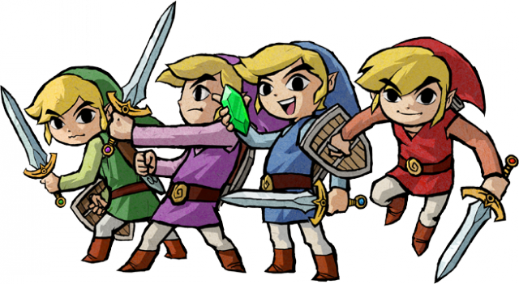

# Daytripper

## **Objectives**

   * Create a web based day planner that records the user's input and saves to local storage by clicking the save button. The textbox rotating color scheme is based on a 24-hour clock. The current hour is highlighted in yellow, past time is a sky blue, and future is a grassy green to give the illusion of a trip through the day. Welcome to Daytripper.

##  **Quest Items** 

🧚🏻 Hey! Listen!

   * 📸  SCREENSHOTS 👀
   * Add Links to Contributors

## **JavaScript Updates**
* Fixed an issue by adding an additional condition that highlights the currentHour a color.
## **HTML Updates**
* Formatted HTML and renamed headline.
* Moved date and time to a single `<h2>`
## **CSS Updates**
* Added a big juicy 🍊 color to `.jumbotron`
* Gettin' box-yyy: Added borders to `.container` and `.row` elements
* FONTS! Gathered fonts from Google and Adobe. 
   - Adobe fonts creditted to the owner where applicable.

## **Troubleshooting**
* On refresh, all text areas clear despite local storage.
## **Contributers**
  

**INTRODUCING MULTIPLAYERS!! :D**
* Eugene Ahn
* Kelly Jefferies
* Daniel Norred

## **Sources**
## **ScreenShots**
## **Links**

------------------------------------------------------------------------------
2022 Dev Wulf for SMU Coding Bootcamp.
